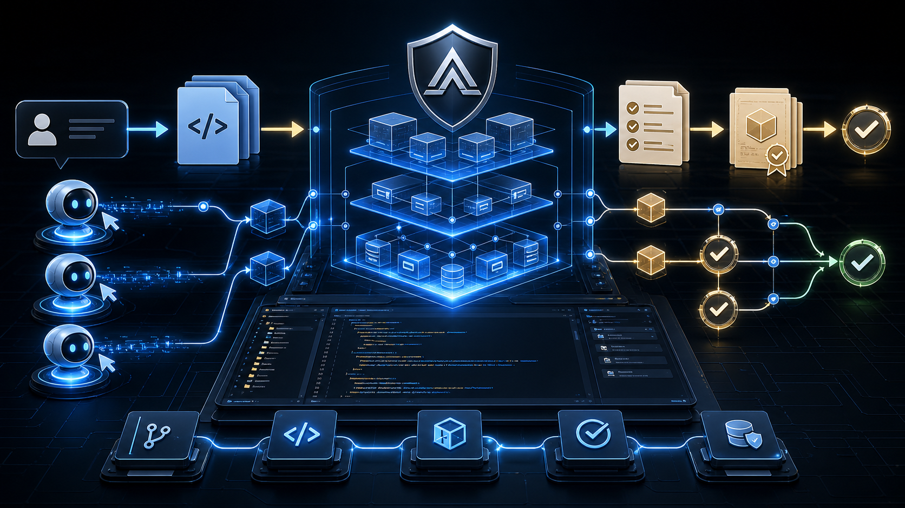

<p align="center">
    <a href="https://linux.do/t/topic/2108966/20" alt="LINUX DO">
        </a>
    <a href="https://dev.to/_879c5a0279451d52e43c3/aegis-a-method-pack-for-more-reliable-ai-coding-agents-1gfm" alt="DEV.to">
        </a>
</p>

<p align="center">
    
</p>

<p align="center">
    <a href="https://github.com/GanyuanRan/Aegis">⭐ 点亮 Star，帮助项目更快更新 ❤️</a>
</p>

# Aegis

<p align="center">
    <strong>Aegis Method Pack</strong><br/>
    面向 AI 编程 agent 的 runtime-ready 工作流程纪律包。
</p>

<p align="center">
    <a href="README.zh-CN.md"><strong>中文</strong></a>
    ·
    <a href="README.md"><strong>English</strong></a>
    ·
    <a href="docs/current/AEGIS_WORKFLOW_GUIDE_ZH.md">工作流程说明</a>
    ·
    <a href="docs/current/AEGIS_WORKFLOW_GUIDE.md">Workflow Guide</a>
</p>

## 极简安装

如果你正在使用 AI 编程 agent，可以直接把下面这段话复制给它：

```text
请仔细阅读 https://github.com/GanyuanRan/Aegis 这个仓库的安装说明，识别我当前使用的 AI 编程宿主，为我完成全局安装；如果需要重启或重新加载宿主，请明确告诉我；然后从 Aegis method-pack 根目录运行完整安装验证：`python scripts/aegis-doctor.py --write-config --json`。只有当 JSON 输出包含 `"ok": true`、`"workspaceSupport": "available"` 和 `"configStatus": "configured"` 时，才把安装视为完成；如果宿主有单独的 skill discovery 目录，也要额外用 `--discovery-root <path>` 验证它指向当前版本。
```

## 更新 Aegis

如果你已经安装过 Aegis，可以直接把下面这段话复制给你的 AI 编程 agent：

```text
请将我已安装的 Aegis 更新到 https://github.com/GanyuanRan/Aegis 的最新 main 分支版本；请根据我当前使用的 AI 编程宿主选择正确的更新路径；如果需要重启或重新加载宿主，请明确告诉我；然后从 Aegis method-pack 根目录运行完整安装验证：`python scripts/aegis-doctor.py --write-config --json`。只有当 JSON 输出包含 `"ok": true`、`"workspaceSupport": "available"` 和 `"configStatus": "configured"` 时，才把更新视为完成；如果宿主有单独的 skill discovery 目录，也要额外用 `--discovery-root <path>` 验证它指向当前版本。
```

## 可选：轻量全局规则

为了让宿主级行为更顺滑，可把下面整个代码块复制到 AI 编程工具的全局用户规则中。
它只负责提升 Aegis 路由和 skill 触发稳定性，不复制完整 workflow：

```markdown
# Aegis 轻量全局规则

如果已安装 Aegis：

- 每轮开始先判断当前任务是否匹配已安装的 Aegis skill；匹配时加载并遵循对应 skill。
- 简单、局部、低风险任务走快速路径，不因为安装了 Aegis 就强行展开完整治理流程。
- 复杂、诊断、架构、重构、接口、跨模块、共享模块、兼容性或长期任务，默认使用对应的 Aegis workflow。
- 实施前先确认目标、范围、影响面和验证方式；必要时读取项目 baseline 或 authority docs。
- 声明完成前必须有新的验证证据；无法验证时说明阻塞点和残余风险。
- Aegis 是方法层，不是最终裁决系统；不得声明最终 gate decision 或 completion authority。
- 用户当前明确指令和目标项目规则优先于 Aegis。
```

对于治理要求更强的团队或大型项目，也可以从完整高级模板开始，只合并需要的部分：

- [中文高级模板](GLOBAL_USER_RULES_TEMPLATE.zh-CN.md)
- [英文高级模板](GLOBAL_USER_RULES_TEMPLATE.md)

## 激活模式

Aegis 默认自动模式。要切换为手动模式，编辑：

```text
~/.config/aegis/config.toml
```

Windows：

```text
%USERPROFILE%\.config\aegis\config.toml
```

如果没有这个文件，需要手动创建。写入：

```toml
activation_mode = "explicit"
```

要切回自动模式，写 `activation_mode = "auto"`，或删除该文件。

然后重启宿主。显式模式下，已支持该开关的 bootstrap hook 不再自动注入
Aegis，但 `aegis:using-aegis` 等显式 skill 调用仍可使用。详细宿主注意事项见
[docs/current/AEGIS_ACTIVATION_MODE.md](docs/current/AEGIS_ACTIVATION_MODE.md)。

`Aegis` 是一个面向 AI 编程代理的架构驱动开发（Architecture-Driven Development, ADD）方法包。

它基于原始 `superpowers` 方法论继续演进，加入了证据驱动治理、TLREF 执行流程，以及“修复轨 + 退役轨”的双轨规则。

在 Aegis 中，ADD 指的是：agent 在进行重要改动前，应先理解项目 baseline、架构边界、owner、影响面、兼容约束与验证路径，再进入实现。

当前发布形态：

> `Aegis Method Pack (runtime-ready)`

本仓库不是完整的 `Aegis Platform`。它不提供 authoritative runtime core 决策，不提供 authoritative `GateDecision`，也不授予 completion authority。

## Aegis 解决什么问题

AI 编程代理擅长局部执行，但复杂或高风险开发任务常见的问题并不只在代码本身：

- 任务边界和 baseline 还没清楚就开始改
- 没有 fresh evidence 就声明完成
- bug 修复新增 fallback，但旧 owner 仍在主链运行
- 长任务在上下文压缩、交接或多 agent 协作后丢状态
- 架构漂移往往等变更扩散后才被发现

Aegis 在 method-pack 层解决这些问题。它要求 agent 先界定任务、回读相关 baseline、让证据贴近结论、把修复轨和退役轨一起追踪，并为长任务保留可恢复的 checkpoint。

## 用户能获得什么收益

安装 Aegis 后，AI 编程工具会获得更严格的开发纪律，但不要求用户先接入一个新的 runtime platform：

- 编辑前更清楚地界定任务
- 调试与重构流程更稳
- 减少没有证据支撑的“已完成”声明
- 通过 todo checkpoint、resume hint、drift check 改善长任务连续性
- 行为变更时显式检查兼容边界与旧逻辑退役
- 在 Codex、OpenCode、Claude Code 等支持 skills / plugins 的宿主之间复用同一套工作流

## Aegis 增加了什么

Aegis 保留了 `superpowers` 的高价值基础：

- 可组合 skills
- skill 触发式工作流
- 多宿主安装与插件分发骨架
- 实施计划、评审、调试、验证等工程实践

Aegis 增加了一条更严格的治理主脊柱：

- baseline first
- evidence before claims
- impact-aware task framing
- TLREF / DIVE / Reflection / QA 执行纪律
- 对 bug 修复、重构、contract 调整、治理清理默认执行修复轨 + 退役轨
- 通过 todo checkpoint、resume hint、drift check、evidence bundle 支撑长任务连续性
- runtime-ready artifacts，但只保持为 draft / hint / projection / evidence bundle

## 当前范围

Aegis 当前负责：

- method-pack skills
- initial instructions 与贡献护栏
- 宿主安装说明
- 代表性测试与验证资产
- runtime-ready artifact shapes
- 面向维护者的发布、回滚、已知限制与兼容性清单

Aegis 当前不负责：

- `Host Adapters`
- `Runtime Core`
- authoritative `GateDecision`
- final completion authority
- 完整生产 rollout 承诺

当前 authority map：

- [docs/current/README.md](docs/current/README.md)
- [docs/adr/ADR-0001-aegis-method-pack-is-not-runtime-core.md](docs/adr/ADR-0001-aegis-method-pack-is-not-runtime-core.md)

## 宿主兼容性

Aegis 保留多宿主 plugin-installable 目标。

当前宿主状态：

| Host | 当前状态 |
| --- | --- |
| `Codex` | representative smoke 主链已验证；Git Bash naive smoke 仍有观察项 |
| `OpenCode` | 当前 method-pack 范围内 base suite 与 integration closeout 已通过 |
| `Claude Code` | 已有 plugin skeleton 与安装说明；release-level fresh host smoke 仍待补证 |
| `CodeBuddy` | 已有 plugin skeleton 与原生 `SKILL.md` 手动安装说明；release-level fresh host smoke 仍待补证 |
| `DeepSeek-TUI` | 原生 `SKILL.md` discovery 支持手动安装 Aegis skills；release-level fresh host smoke 仍待补证 |
| `Trae` | 原生 `SKILL.md` discovery 支持手动安装 Aegis skills；release-level fresh host smoke 仍待补证 |

其它宿主仍是产品目标，但还不是当前 release-level verdict。

阅读：

- [docs/current/AEGIS_HOST_COMPATIBILITY_MATRIX_SNAPSHOT.md](docs/current/AEGIS_HOST_COMPATIBILITY_MATRIX_SNAPSHOT.md)
- [docs/current/AEGIS_KNOWN_LIMITATIONS.md](docs/current/AEGIS_KNOWN_LIMITATIONS.md)

## 安装

Aegis 通过各宿主原生的 skill discovery 或 plugin 路径安装。
下面这些路径不依赖公开 marketplace 已上架。

安装并重启宿主后，Aegis skills 会被自动发现。日常使用时，用户可以自然描述开发任务；
当任务匹配某个 skill 时，agent 应自动选择对应的 Aegis 方法。显式 skill 命令仍然保留，
用于强制指定、测试或排查某个 workflow。

### Codex

macOS / Linux：

```bash
git clone https://github.com/GanyuanRan/Aegis.git ~/.codex/aegis
mkdir -p ~/.agents/skills
ln -s ~/.codex/aegis/skills ~/.agents/skills/aegis
```

Windows PowerShell：

```powershell
git clone https://github.com/GanyuanRan/Aegis.git "$env:USERPROFILE\.codex\aegis"
New-Item -ItemType Directory -Force -Path "$env:USERPROFILE\.agents\skills"
cmd /c mklink /J "$env:USERPROFILE\.agents\skills\aegis" "$env:USERPROFILE\.codex\aegis\skills"
```

可选：如果要使用 subagent-heavy skills，在 Codex 配置中启用：

```toml
[features]
multi_agent = true
```

重启 Codex，然后要求它使用 `aegis:using-aegis` 或 `brainstorming` 等 Aegis skill。

### OpenCode

配置文件快捷安装：在全局或项目级 `opencode.json` 的 `plugin` 数组中加入 Aegis：

```json
{
  "plugin": ["aegis@git+https://github.com/GanyuanRan/Aegis.git"]
}
```

如果已有其它插件，追加 Aegis：

```json
{
  "plugin": [
    "other-plugin",
    "aegis@git+https://github.com/GanyuanRan/Aegis.git"
  ]
}
```

然后重启 OpenCode 并验证：

```bash
opencode --version
```

询问：`Tell me about your aegis`。

### Claude Code

Marketplace flow：

```bash
claude plugin marketplace add GanyuanRan/Aegis
claude plugin install aegis@aegis-dev --scope user
```

本地 checkout flow：

```bash
git clone https://github.com/GanyuanRan/Aegis.git ~/aegis
claude --plugin-dir ~/aegis
```

在 Claude Code 中运行 `/reload-plugins`，然后尝试 `/aegis:using-aegis`。

### CodeBuddy

CodeBuddy 同时支持 plugin metadata 和原生 `SKILL.md` skill discovery。
如果走最透明的手动路径：

macOS / Linux：

```bash
git clone https://github.com/GanyuanRan/Aegis.git ~/.codebuddy/aegis
mkdir -p ~/.codebuddy/skills
cp -R ~/.codebuddy/aegis/skills/* ~/.codebuddy/skills/
```

Windows PowerShell：

```powershell
git clone https://github.com/GanyuanRan/Aegis.git "$env:USERPROFILE\.codebuddy\aegis"
New-Item -ItemType Directory -Force -Path "$env:USERPROFILE\.codebuddy\skills"
Copy-Item -Recurse -Force "$env:USERPROFILE\.codebuddy\aegis\skills\*" "$env:USERPROFILE\.codebuddy\skills\"
```

Aegis 也提供 `.codebuddy-plugin/` 元数据给 CodeBuddy plugin flow 使用。
重启 CodeBuddy，然后询问它有哪些 Aegis skills。

### DeepSeek-TUI

DeepSeek-TUI 会从 `SKILL.md` 目录发现 skills。安装 Aegis 时，把 Aegis 的
skill 目录复制到 DeepSeek-TUI 的全局 skills 路径：

macOS / Linux：

```bash
git clone https://github.com/GanyuanRan/Aegis.git ~/.deepseek/aegis
mkdir -p ~/.deepseek/skills
cp -R ~/.deepseek/aegis/skills/* ~/.deepseek/skills/
```

Windows PowerShell：

```powershell
git clone https://github.com/GanyuanRan/Aegis.git "$env:USERPROFILE\.deepseek\aegis"
New-Item -ItemType Directory -Force -Path "$env:USERPROFILE\.deepseek\skills"
Copy-Item -Recurse -Force "$env:USERPROFILE\.deepseek\aegis\skills\*" "$env:USERPROFILE\.deepseek\skills\"
```

重启 DeepSeek-TUI，然后用 `/skills` 和 `/skill using-aegis` 验证。

### Trae

Trae 会从 `SKILL.md` 目录发现 skills。安装 Aegis 时，把 Aegis 的 skill
目录复制到 Trae 的全局 skills 路径：

macOS / Linux：

```bash
git clone https://github.com/GanyuanRan/Aegis.git ~/.trae/aegis
mkdir -p ~/.trae/skills
cp -R ~/.trae/aegis/skills/* ~/.trae/skills/
```

Windows PowerShell：

```powershell
git clone https://github.com/GanyuanRan/Aegis.git "$env:USERPROFILE\.trae\aegis"
New-Item -ItemType Directory -Force -Path "$env:USERPROFILE\.trae\skills"
Copy-Item -Recurse -Force "$env:USERPROFILE\.trae\aegis\skills\*" "$env:USERPROFILE\.trae\skills\"
```

重启 Trae，然后询问它有哪些 Aegis skills。

完整宿主说明：

- [Claude Code](docs/README.claude-code.md)
- [CodeBuddy](docs/README.codebuddy.md)
- [Codex](docs/README.codex.md)
- [DeepSeek-TUI](docs/README.deepseek-tui.md)
- [OpenCode](docs/README.opencode.md)
- [Trae](docs/README.trae.md)

本项目仍保留继承自 `superpowers` 的多宿主分发骨架，包括 Cursor、Gemini 等相关包面。但除非兼容性矩阵明确说明，不应把这些目标理解为已经完成当前 fresh release-level closeout。

## 首次项目基线

Aegis 在目标项目存在小而明确的 baseline 时效果最好。没有 baseline 时，Aegis
仍然可以运行，但任务界定、authority 查找、验证方式和漂移检查会更依赖临场上下文，
稳定性会下降。

对于新项目或缺少文档的项目，建议先要求 agent 建立轻量项目 baseline，例如：

```text
使用 Aegis 先为本项目建立 baseline，再开始实现：
项目目标、当前架构、authority docs、运行/测试命令、兼容边界、非目标和验证预期。
```

对于已有项目，先把当前 source of truth 指给 agent，例如 `README`、`CONTRIBUTING`、
架构文档、ADR 或本地项目规则，并要求它在改代码前把这些材料作为 baseline references。

## 运行机制

Aegis 不是 daemon、后台 runner，也不是 authoritative runtime core。它通过宿主的 skill discovery、bootstrap context 和显式 skill loading 生效。

自动行为：

- Codex 启动时从配置好的 skills 目录发现 Aegis skills。
- OpenCode 加载 Aegis plugin，将 skills 镜像到 OpenCode 全局 skills 路径，并注入紧凑 bootstrap context。
- Claude Code 通过 plugin namespace 或本地 plugin directory 加载 Aegis。
- CodeBuddy 从原生 `SKILL.md` skill 路径发现已复制的 Aegis skill 目录，也可以通过 `.codebuddy-plugin/` 元数据加载 Aegis。
- DeepSeek-TUI 从原生 `SKILL.md` skill 路径发现已复制的 Aegis skill 目录。
- Trae 从原生 `SKILL.md` skill 路径发现已复制的 Aegis skill 目录。
- `using-aegis` 会要求 agent 在回应前判断当前任务是否需要加载任务专属 skill。
- 日常使用不需要每次手动点名 skill；显式命令主要用于你想强制指定某个方法时。

显式调用：

- 直接点名 skill，例如 `aegis:brainstorming`、`aegis:systematic-debugging`、
  `aegis:long-task-continuation`、`aegis:verification-before-completion`。
- 当你希望开工前先框定目标时，可以使用 `/aegis-goal <任务>`，或跨宿主更稳的
  `Aegis goal: <任务>`。它只设置目标、成功证据、停止条件和非目标，然后继续路由；
  默认不创建项目文件。
  示例：`Aegis goal: 修复登录后偶发跳回登录页，不重写 auth 系统。`
- 在 OpenCode 中使用原生 `skill` tool，例如：`use skill tool to load aegis/brainstorming`。
- 在 Claude Code 中使用 plugin namespace，例如：`/aegis:using-aegis`。
- 在 CodeBuddy 中要求它加载某个 Aegis skill，例如 `systematic-debugging`。
- 在 DeepSeek-TUI 中使用原生 skill 命令，例如：`/skill systematic-debugging`。
- 在 Trae 中要求它加载某个 Aegis skill，例如 `systematic-debugging`。

长任务行为：

- Aegis 可以围绕长任务维护 `TodoCheckpointDraft`、`ResumeStateHint`、`DriftCheckDraft` 和 `EvidenceBundleDraft` 纪律。
- 这会提升可恢复性并降低跑偏风险，但它不是宿主 watchdog、自动重试循环，也不授予最终 completion authority。

## 核心工作流

方法包围绕以下 agent workflows 组织：

1. **Brainstorming**
   - 实施前澄清意图、范围、影响面与 baseline read set
2. **Writing Plans**
   - 产出细粒度、可验证、路径明确、边界清楚的实施计划
3. **Systematic Debugging**
   - 用证据从现象追到真实根因，再谈修复
4. **Test-Driven Development**
   - 在适用场景中使用 red / green / refactor
5. **Requesting Code Review**
   - 优先检查行为风险、回归风险与缺失测试
6. **Verification Before Completion**
   - 没有 fresh verification evidence，就不声明完成

Aegis 会在实施前先按复杂度路由：

- 低复杂度任务：简短 intent、baseline check、TDD 与验证即可。
- 中复杂度任务：必须先有 baseline read set、Spec Brief 或稳定需求、plan 和 atomic tasks，再进入 TDD。
- 高复杂度任务：必须先有 Design Spec 和 plan；workflow 要求用户确认时不能跳过确认。

工作流质量护栏用于保证这套路由在真实任务里保持实用：简单任务继续走 fast path，
中高风险任务才生成必要证据和 artifacts，输出先使用 compact contracts，只有风险升高时
才展开完整 workflow 结构。阅读
[docs/current/AEGIS_WORKFLOW_QUALITY_BASELINE.md](docs/current/AEGIS_WORKFLOW_QUALITY_BASELINE.md)。

当项目需要持久化 Aegis 记录时，Aegis 会懒创建轻量项目工作区。默认工作区包含
`docs/aegis/` 下的 `README.md`、`INDEX.md`、`BASELINE-GOVERNANCE.md`，
以及标准的 `adr/`、`baseline/`、`specs/`、`plans/`、`work/` 目录。任务过程记录放在
`docs/aegis/work/YYYY-MM-DD-<task-slug>/`。已有项目文档和 ADR 仍优先作为
authority；可复用的 Aegis 产物只在 workflow 需要时提升。

推荐安装方式会保留 Aegis method-pack 根目录，以便安装后验证项目工作区能力。Aegis
method-pack 仓库自身不预置 live `docs/aegis/` 工作区。工作区结构检查不判断
evidence sufficiency，也不授予 completion authority。

维护者可以用下面的命令验证完整安装，并写入稳定的本地 helper 路径：

```bash
python scripts/aegis-doctor.py --write-config --json
```

完整安装验证必须返回 `"ok": true`、`"workspaceSupport": "available"` 和
`"configStatus": "configured"`。

如果某个宿主有单独的 skill discovery 目录，可额外传入
`--discovery-root <path>`，确认它指向当前 method-pack skills，而不是旧的复制版本。

如果 Aegis 已安装，但预期的 skill 不能稳定自动触发，不要先把它当成提示词措辞问题。
应按触发链路诊断：

1. 验证 method-pack 版本和安装根目录
2. 验证宿主 discovery 目录是否指向当前 `skills/`
3. 确认宿主是否已经按要求重启或 reload
4. 检查 `activation_mode`，确认当前是否期望自动 bootstrap
5. 显式调用 `aegis:using-aegis`，再显式调用预期 skill
6. 用 trigger-health matrix 对照典型任务和预期 skill

长会话、大量工具输出、恢复上下文或上下文压缩后，可以显式要求
`aegis:using-aegis` 重新路由当前任务，再继续非平凡工作。

诊断分层见 `docs/current/AEGIS_TRIGGER_HEALTH_BASELINE.md`。

对 bug 修复、架构变更、contract 工作与治理清理，Aegis 要求：

- **修复轨**
  - 真实根因
  - canonical owner
  - 最小必要改动
  - 兼容边界
  - 验证方式
- **退役轨**
  - old owner / fallback / patch 位置
  - 是否仍在主链生效
  - 若保留，唯一理由是什么
  - 删除或收敛触发条件
  - 删除前验证方式

## Runtime-Ready Artifacts

当前 method-pack 可以产出：

- `TaskIntentDraft`
- `BaselineReadSetHint`
- `ImpactStatementDraft`
- `EvidenceBundleDraft`
- `GateInputPack`
- `SubagentContextPacket`
- `TodoCheckpointDraft`
- `ResumeStateHint`
- `DriftCheckDraft`

这些是 advisory / runtime-ready artifacts，不是 authoritative runtime decisions。

阅读：

- [docs/current/AEGIS_ARTIFACT_SCHEMA_BASELINE.md](docs/current/AEGIS_ARTIFACT_SCHEMA_BASELINE.md)
- [docs/current/AEGIS_RUNTIME_READY_BOUNDARY.md](docs/current/AEGIS_RUNTIME_READY_BOUNDARY.md)

## 测试

主要验证入口：

```bash
bash tests/e2e/run-all.sh --full --host-profile fast
```

聚焦检查：

```bash
bash tests/e2e/boundary-compliance-check.sh
bash tests/e2e/artifact-schema-check.sh
bash tests/e2e/workflow-quality-check.sh
bash tests/opencode/run-tests.sh
bash tests/codex-plugin-sync/test-sync-to-codex-plugin.sh
```

阅读：

- [docs/testing.md](docs/testing.md)
- [docs/current/AEGIS_METHOD_PACK_RELEASE_CHECKLIST.md](docs/current/AEGIS_METHOD_PACK_RELEASE_CHECKLIST.md)

## 贡献

阅读：

- [CONTRIBUTING.md](CONTRIBUTING.md)
- [SECURITY.md](SECURITY.md)
- [SUPPORT.md](SUPPORT.md)
- [CODE_OF_CONDUCT.md](CODE_OF_CONDUCT.md)

修改会影响 agent 行为的 skill 内容前，还应阅读：

- [skills/first-principles-review/SKILL.md](skills/first-principles-review/SKILL.md)
- [skills/writing-skills/SKILL.md](skills/writing-skills/SKILL.md)
- [skills/verification-before-completion/SKILL.md](skills/verification-before-completion/SKILL.md)

## 与 Superpowers 的关系

Aegis 派生自 **[Superpowers](https://github.com/obra/superpowers)**，由 [Jesse Vincent](https://github.com/obra) 创建。Superpowers 首创了 composable、多宿主 agent skills 的理念——这是本项目赖以构建的基石。

我们感谢 Jesse 以及所有 Superpowers 贡献者以 MIT 许可证创建并维护原项目，也感谢他们建立的插件分发模式（Claude Code、Codex、Cursor、OpenCode、Gemini CLI），Aegis 至今仍在沿用。

本项目在此基础上增加面向 `Aegis Method Pack` 的治理方法层与公开发布路径，同时保留 Superpowers 的零依赖哲学与多宿主兼容性。

## 致谢

感谢 [Matt Pocock](https://github.com/mattpocock) 以及 [mattpocock/skills](https://github.com/mattpocock/skills)（MIT 许可证）的所有贡献者，将其技能设计开放共享。该项目中关于极简沟通、共享语言词汇表与严谨调试的若干思路，对 Aegis 的技能设计产生了影响。

| Aegis 技能 | 灵感来源 | 借鉴内容 |
|-----------|---------|---------|
| `communicating-concisely` | `/caveman` | 极简沟通模式，含安全场景自动退出机制 |
| `establishing-project-context` | `/grill-with-docs` | CONTEXT.md 共享语言系统，brainstorming 中术语收紧 |
| `recording-architecture-decisions` | `/grill-with-docs` ADR 纪律 | ADR 生命周期与架构基线同步闭环 |
| 反馈回路构建 | `/diagnose` Phase 1 | 构建自动化 bug 复现回路的优先级梯子 |

以上借鉴均为在 Aegis 自有格式中的重新实现——更短、多宿主兼容、与 TLREF/DIVE/Reflection 治理脊柱咬合，而非原样复制。

内部实施记录不进入公开发行树。公开 contract 以 skill 内容、current authority docs
与本致谢为准。

## 许可证

MIT License。见 [LICENSE](LICENSE)。
