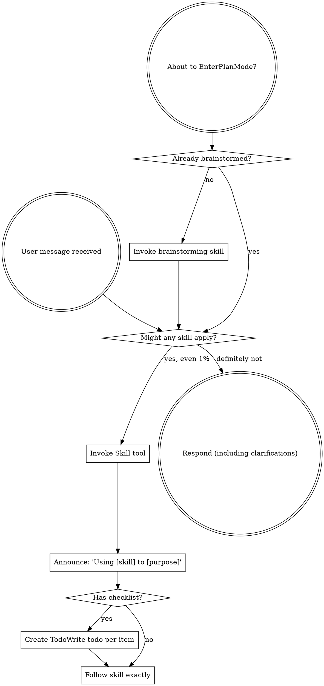

# Using Aegis: Full Skill Discipline

Use this reference when the compact `using-aegis` hot path is not enough to
decide how to trigger skills, order multiple workflows, or adapt tool names for
a host.

## Instruction Priority

Aegis skills override default system prompt behavior, but **user instructions
always take precedence**:

1. **User's explicit instructions** (`CLAUDE.md`, `GEMINI.md`, `AGENTS.md`,
   direct requests) - highest priority
2. **Aegis skills** - override default system behavior where they conflict
3. **Default system prompt** - lowest priority

If a project file says "don't use TDD" and a skill says "always use TDD,"
follow the user's instructions. The user is in control.

## How to Access Skills

**In Claude Code:** Use the `Skill` tool. When you invoke a skill, its content
is loaded and presented to you. Follow it directly.

**In Copilot CLI:** Use the `skill` tool. Skills are auto-discovered from
installed plugins. The `skill` tool works the same as Claude Code's `Skill`
tool.

**In Gemini CLI:** Skills activate via the `activate_skill` tool. Gemini loads
skill metadata at session start and activates the full content on demand.

**In other environments:** Check the platform's documentation for how skills
are loaded.

## Platform Adaptation

Skills use Claude Code tool names. Non-CC platforms: see:

- `references/copilot-tools.md`
- `references/codex-tools.md`
- `references/gemini-tools.md`

## The Rule

Invoke relevant or requested skills before any response or action. Even a 1%
chance a skill might apply means you should invoke the skill to check. If an
invoked skill turns out to be wrong for the situation, you do not need to use
it.

## Skill Flow

## Red Flags

These thoughts mean STOP - you're rationalizing:

| Thought | Reality |
|---------|---------|
| "This is just a simple question" | Questions are tasks. Check for skills. |
| "I need more context first" | Skill check comes before clarifying questions. |
| "Let me explore the codebase first" | Skills tell you how to explore. Check first. |
| "I can check git/files quickly" | Files lack conversation context. Check for skills. |
| "Let me gather information first" | Skills tell you how to gather information. |
| "This doesn't need a formal skill" | If a skill exists, use it. |
| "I remember this skill" | Skills evolve. Read current version. |
| "This doesn't count as a task" | Action means task. Check for skills. |
| "The skill is overkill" | Simple things become complex. Use it. |
| "I'll just do this one thing first" | Check before doing anything. |
| "This feels productive" | Undisciplined action wastes time. Skills prevent this. |
| "I know what that means" | Knowing the concept is not using the skill. Invoke it. |

## Skill Priority

When multiple skills could apply, use this order:

1. **Process skills first** - brainstorming, debugging, planning, review
2. **Implementation skills second** - frontend, MCP, domain-specific build work

Examples:

- "Let's build X" -> brainstorming first, then implementation skills
- "Fix this bug" -> debugging first, then domain-specific skills

## Skill Types

**Rigid** skills such as TDD and debugging must be followed exactly.

**Flexible** skills provide patterns that adapt to the current context.

The skill itself tells you which mode applies.

## User Instructions

Instructions say what, not how. "Add X" or "Fix Y" does not mean skip
workflows.
